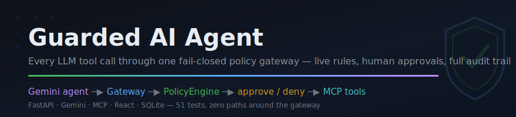
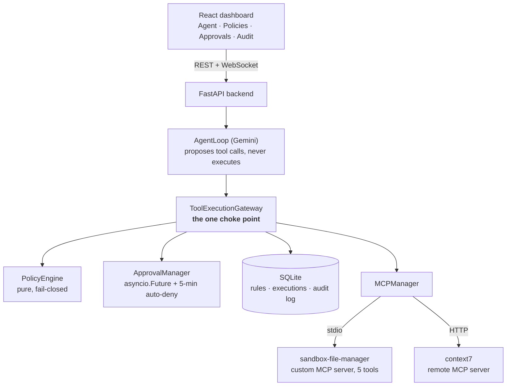

<p align="center">
  
</p>

<p align="center"><b>A full-stack guardrail system that forces every LLM tool call through one fail-closed policy gateway — live-editable rules, human-in-the-loop approvals, and an immutable audit trail. 51 tests, zero code paths around the gateway.</b></p>

<p align="center">
  
  
  
  
  
  
  
</p>

---

## What it does

An LLM agent (Gemini) proposes tool calls over MCP — file operations against a custom sandboxed server, documentation lookups against a remote one. It **executes none of them**. Every proposed call is routed through a single `ToolExecutionGateway` that evaluates admin-configured policy rules, freezes the agent mid-turn when a human must approve, denies anything unpolicied by default, and persists every decision to an audit trail. Rules are edited live from a React dashboard and apply on the very next tool call — no restart.

<p align="center">
  
</p>

The core idea worth stealing: **the policy engine's input type is the enforcement mechanism.** `PolicyContext` is a frozen dataclass with slots only for structured facts — tool name, server, arguments, conversation id, real token usage. There is no field for model-generated text, so prompt-injected "reasoning" *cannot* influence a policy decision — not because a filter catches it, but because the decision function has nowhere to put it.

```python
@dataclass(frozen=True)
class PolicyContext:
    tool_name: str
    server_name: str
    arguments: dict
    conversation_id: str
    current_token_usage: int
    # No reasoning/user_intent/llm_text field may ever be added here —
    # that would reopen the exact prompt-injection bypass this module exists to close.
```

## See it in action

One real conversation, every guardrail outcome — `list_files` allowed by rule, `write_file` frozen mid-turn until a human approves, `delete_file` denied by precedence, an unpolicied tool denied fail-closed — with live policy blocks in the chat and real Gemini token usage in the header:


A `write_file` call blocked mid-turn, streaming live — the agent cannot proceed until a human decides (or a 5-minute timer auto-denies):


A tool call with no matching rule, denied by the fail-closed default — not a crash, not an implicit allow:


## By the numbers

All measured from this repo, not estimated:

| Metric | Value |
|---|---|
| Tests (no network, no API keys — MCP/Gemini faked at the boundary) | **51 passing in 11.6s** |
| MCP tools discovered live at startup | **7 across 2 servers** (5 stdio + 2 remote HTTP) |
| Policy rule types | **5** (`allow_tool`, `block_tool`, `require_approval`, `input_validation`, `token_budget`) |
| Code paths that can invoke a tool | **1** (`Gateway.execute_tool()` → `MCPManager.call()`) |
| Default decision with zero matching rules | **DENY** (fail-closed, tested) |
| Backend app / backend tests / frontend | **1,723 / 1,522 / 1,372 LOC** |
| Custom MCP server | **118 LOC**, path-confined, 5 tools |

## Highlights

- **One choke point, structurally enforced.** `AgentLoop` holds a read-only `ToolCatalog` facade and a gateway reference — it never imports `MCPManager`. No matter what the LLM decides, execution is only reachable through `ToolExecutionGateway.execute_tool()`.
- **Fail-closed everywhere, deliberately.** No matching rule → DENY. Approver offline → 5-minute auto-deny. Process killed with approvals pending → startup reconciliation denies every orphaned row before accepting traffic. Policy engine throws → DENY.
- **Approval race handled with one conditional UPDATE.** The HTTP approver, the auto-deny timer, and startup reconciliation all race on `UPDATE approval_requests SET status=... WHERE status='PENDING'` — whichever matches the row wins; the rest are no-ops. No locks, no flags.
- **Human approval doesn't outlive policy.** After a human approves, policy is re-checked immediately before execution — if an admin changed the rule while the request sat pending, a fresh DENY still blocks it.
- **Real token budgets, not placeholders.** Gemini's `usage_metadata.total_token_count` is accumulated across every call in a turn and persisted per-conversation, so `token_budget` rules evaluate against actual spend — including mid-turn, before later calls are checked.
- **Live rules with zero invalidation machinery.** Rules are read fresh from SQLite on every tool call (explicitly never cached) — that one decision is the entire mechanism behind "dashboard edits apply instantly."
- **A custom MCP server with defense-in-depth.** `sandbox-file-manager` enforces path confinement inside the server itself (`_resolve_within_sandbox`), independent of whatever the policy layer decides.
- **Pure-function policy engine.** `evaluate(context, rules) -> decision` — no I/O, no side effects, which is why every rule type and every conflict combination is unit-tested without a database or network.

## Architecture



Every tool call follows the same lifecycle, each step broadcast over WebSocket to the dashboard and written to the audit log: `tool_requested` → `policy_decided` → (`approval_required` →) `execution_started` → `execution_completed`/`execution_failed`. DENY synthesizes a failed tool result and feeds it back to the model — the agent recovers and explains instead of crashing.

**Conflict resolution is fixed-precedence, not first-match:** all enabled matching rules are gathered, then reduced by `DENY > REQUIRE_APPROVAL > ALLOW`, so rule-creation order never changes an outcome (the seed data ships a real DENY-vs-REQUIRE_APPROVAL conflict on `delete_file` to prove it).

## Quick start

**Backend** (Python 3.12+, [uv](https://docs.astral.sh/uv/)):

```bash
cd backend
uv sync
# create .env (see .env.example):
#   GEMINI_API_KEY=...
#   CONTEXT7_API_KEY=...   (optional — higher context7 rate limit)
uv run uvicorn main:app --reload --port 8000
```

The custom MCP server needs no manual step — `MCPManager` spawns it as a stdio subprocess on startup and discovers its tools live.

**Frontend**:

```bash
cd frontend
npm install
npm run dev     # http://localhost:5173, proxies /api and /ws to :8000
```

**Tests** (no API keys or network needed):

```bash
cd backend
uv run pytest -q     # 51 passed
```

### Configuration (`backend/config.py`, env-driven)

| Var | Default | Purpose |
|---|---|---|
| `GEMINI_API_KEY` | *(required)* | Gemini API access |
| `GEMINI_MODEL` | `gemini-2.5-flash` | Model for the agent loop |
| `CONTEXT7_API_KEY` | *(empty)* | Optional, raises context7 rate limit |
| `MAX_AGENT_STEPS` | `10` | Cap on the ReAct loop per turn |
| `POLICY_RULES_PATH` | `policy_rules.yaml` | One-time seed for the rules table |
| `DATABASE_URL` | `sqlite+aiosqlite:///./guarded_agent.db` | Swappable via env for tests |
| `APPROVAL_TIMEOUT_SECONDS` | `300` | Auto-deny timer for pending approvals |

## Repository layout

```
backend/                 FastAPI app
  main.py                  composition root + all HTTP/WebSocket routes
  agent_loop.py            Gemini ReAct loop — proposes calls, never executes
  gateway.py               ToolExecutionGateway — the single choke point
  policy_engine.py         pure evaluate(context, rules) -> decision, fail-closed
  approval_manager.py      asyncio.Future registry for pending approvals
  mcp_manager.py           MCP client — live tool discovery, the privileged call()
  gemini_client.py         Gemini SDK wrapper + error normalization
  schema_sanitizer.py      strips JSON-Schema keywords Gemini's API rejects
  models.py, db.py         SQLAlchemy models + async SQLite engine
  test_*.py, tests/        51 tests
mcp-servers/
  sandbox-file-manager/    custom MCP server (FastMCP, stdio) — 118 LOC, 5 tools
frontend/                React 19 + Vite + Tailwind dashboard
  src/pages/               Agent, Policies, Approvals, Audit Logs
  src/ws/                  WebSocket client (auto-reconnect + state re-hydration)
docs/                    banner, demo GIF, screenshots
```

## Technical notes

<details>
<summary><b>The approval workflow — freezing an agent mid-turn</b></summary>

When policy returns `REQUIRE_APPROVAL`, the gateway persists an `approval_requests` row (`PENDING`), registers an `asyncio.Future`, broadcasts `approval_required` over WebSocket, and **awaits the future** — the agent's turn is genuinely suspended inside its own tool-call step. `POST /approvals/{id}` or the 5-minute timer resolves it. The single race arbiter between the HTTP handler, the timer, and startup reconciliation is a conditional `UPDATE ... WHERE status='PENDING'` — whichever caller's UPDATE matches the row wins, everyone else's is a no-op. On process restart, `reconcile_pending_approvals()` fail-closes every orphaned `PENDING` row, because the in-memory future and timer that would have resolved it died with the old process. And after a human approves, policy is re-evaluated before execution — approval never overrides a rule that changed while the request sat pending.
</details>

<details>
<summary><b>Why the policy engine is a pure function</b></summary>

`policy_engine.py` exports `evaluate(context: PolicyContext, rules: list[Rule]) -> PolicyDecision` — no I/O, no MCP, no side effects. Rule loading (`load_rules()`) is a separate, deliberately uncached DB read on every tool call, which is the entire "live rule edits" mechanism. Purity is what makes the test story work: every rule type, the fail-closed default, and every precedence conflict (both creation orders) are exercised in-memory. `input_validation` denies when a named argument doesn't start with a required prefix; `token_budget` compares the conversation's real accumulated Gemini token count against a cap. Tool *output* is separately scanned for prompt-injection phrases, but that flag is audit-only — it is never fed back into a policy decision, and `PolicyContext` has no field it could occupy.
</details>

<details>
<summary><b>MCP integration — discovery, sanitization, and safe retries</b></summary>

`MCPManager` builds the whole tool registry from live `session.list_tools()` responses; adding a server is one `ServerSpec` entry. Because MCP tool schemas get fed to Gemini's function-calling API, `schema_sanitizer.py` recursively strips the JSON-Schema keywords Gemini 400s on (`additionalProperties`, `$schema`, `title`, `default`, `pattern`, `propertyNames`) and renames `oneOf` → `anyOf` before any schema reaches Gemini. `MCPManager.call()` never raises: transport errors and a 30s timeout become `ToolResult(ok=False, ...)`, with one automatic retry for read-only/idempotent tools only (`list_files`, `read_file`, `resolve-library-id`, `query-docs`) — never a write/move/delete, so a retry can't double-apply a mutation.
</details>

<details>
<summary><b>Failure modes — what actually happens</b></summary>

**MCP server crashes mid-call** → `ToolResult(ok=False)`, synthesized failed function-response, the model recovers. **LLM API fails** (quota, rate limit, outage) → normalized to one `LLMUnavailableError`, returned as a clean `503` plus an audit-log row; the user's message stays persisted, no phantom assistant reply. **Hallucinated tool name** → synthesized failed result fed back to the model, never a crash. **WebSocket drops during a long approval wait** → the client reconnects with exponential backoff and re-hydrates the full transcript (messages *and* resolved tool-call blocks) from `GET /chat/state`, so nothing visual is lost. Known accepted trade-offs: single ongoing conversation, `create_all`-style schema management (no Alembic), full history loaded at startup — all fine for a single-user localhost deployment and documented as such.
</details>

Natural extensions: multi-conversation history, Alembic migrations, per-argument rule conditions beyond prefix matching, and role-based approvers.

Built in three days as a graded systems exercise — what it proves is the interesting part: LLM guardrails you can't prompt-inject around, because the bypass isn't filtered out, it's structurally unrepresentable.
