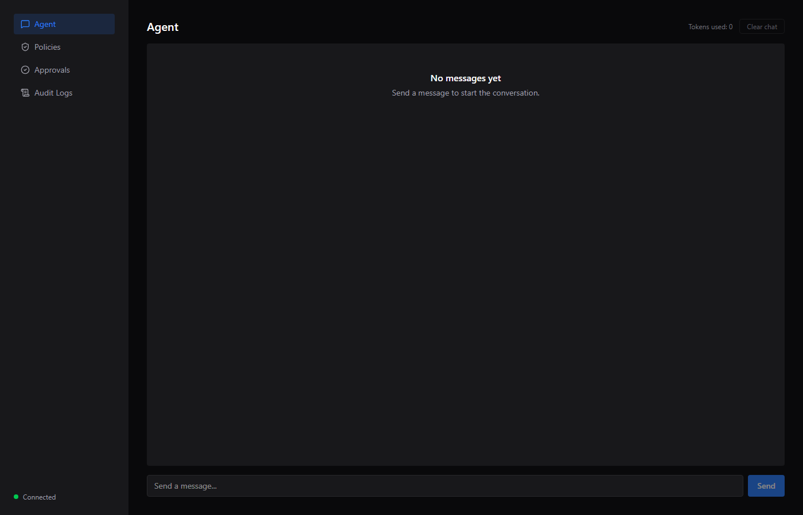
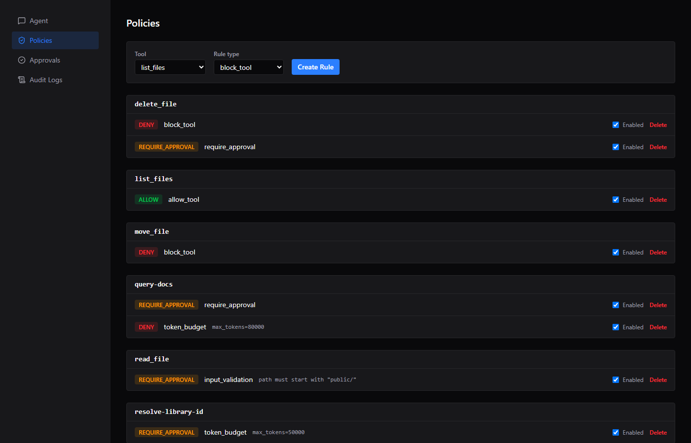
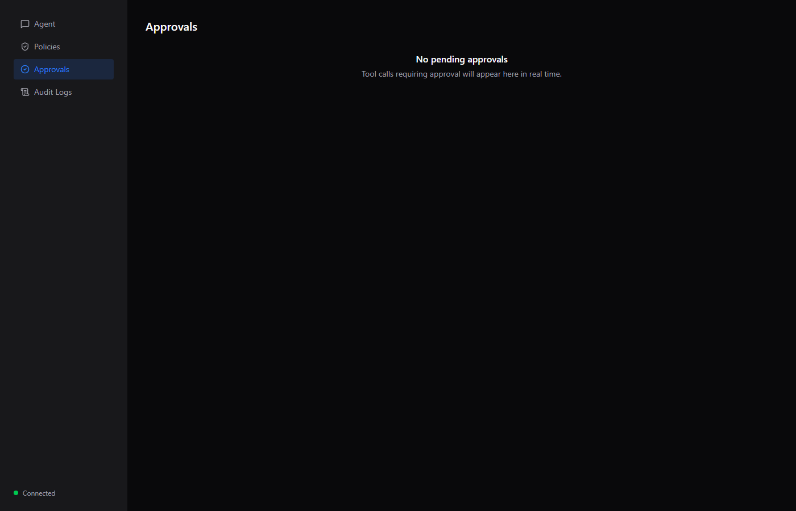
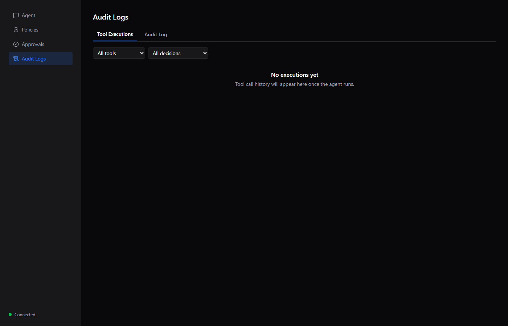
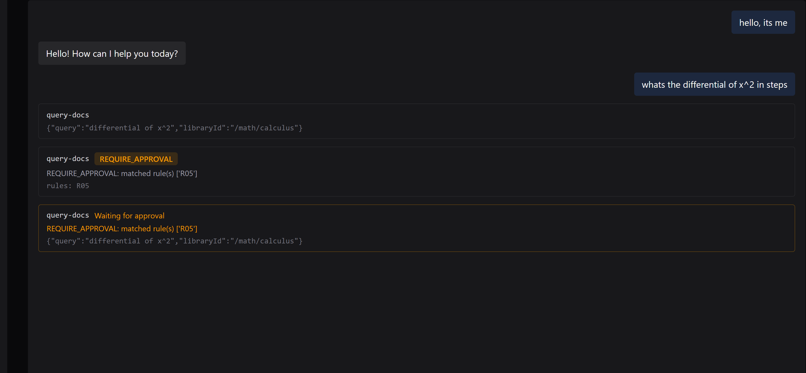
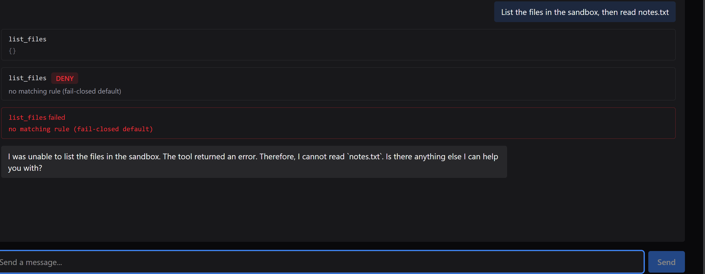

# Guarded AI Agent

A full-stack system that puts a **policy engine between an LLM agent and its tools**. The agent proposes tool calls over MCP (Model Context Protocol); every single call — regardless of which server it targets — is routed through one gateway that checks it against admin-configured guardrail rules, enforces human-approval workflows, and writes an immutable audit trail. Rules are edited live from a web dashboard and take effect on the agent's very next tool call, with no restart.

```
Browser (React) ── WebSocket + REST ──▶ FastAPI backend
                                          │
                                    AgentLoop (Gemini)
                                          │  proposes a tool call, never executes it
                                          ▼
                              ToolExecutionGateway  ◀── the ONE choke point
                                          │
                        ┌─────────────────┼─────────────────┐
                        ▼                 ▼                 ▼
                 PolicyEngine       ApprovalManager     AuditLog / ToolExecution
                (fail-closed,       (asyncio.Future +   (SQLite, every decision
                 DB-backed rules)    5-min auto-deny)    persisted)
                        │
                        ▼
                  MCPManager ── stdio ──▶ sandbox-file-manager (custom MCP server)
                        └────── HTTP  ──▶ context7 (remote MCP server)
```

---

## Why it's built this way

The one architectural rule everything else follows: **the agent loop can never reach tool execution directly.** `AgentLoop` holds only a read-only `ToolCatalog` facade (schema/name lookup) and a `Gateway` reference — it never imports `MCPManager` and never calls `.call()` on it. Every proposed tool call, no matter what the LLM decided, is forced through `ToolExecutionGateway.execute_tool()`, which is the only code path allowed to invoke `MCPManager.call()`. That's what makes "an LLM can't bypass its guardrails" true in the code, not just a convention.

The second rule: the **policy engine only ever sees structured facts**, never the model's free text.

```python
@dataclass(frozen=True)
class PolicyContext:
    tool_name: str
    server_name: str
    arguments: dict
    conversation_id: str
    current_token_usage: int
    # No reasoning/user_intent/llm_text field may ever be added here —
    # that would reopen the exact prompt-injection bypass this module exists to close.
```

A tool's *output* is scanned for injection phrases for logging/audit purposes, but that scan result is never fed back into a policy decision — it can't be, because the decision function's input type has no slot for it.

---

## Repository layout

```
backend/            FastAPI app — agent loop, policy engine, gateway, MCP client, DB
  main.py             composition root + all HTTP/WebSocket routes
  agent_loop.py       Gemini tool-use loop (ReAct-style step loop)
  gemini_client.py    Gemini SDK wrapper — schema building, generate(), error normalization
  mcp_manager.py      connects to every MCP server, live tool discovery, the privileged call()
  gateway.py          ToolExecutionGateway — the single choke point, approval flow, audit writes
  policy_engine.py    pure evaluate(context, rules) -> decision function, fail-closed
  approval_manager.py in-process asyncio.Future registry for pending approvals
  ws_manager.py       WebSocket fan-out for the dashboard's live event feed
  schema_sanitizer.py strips JSON-Schema keywords Gemini's function-calling rejects
  models.py           SQLAlchemy models: Conversation, Message, PolicyRule, ApprovalRequest, ToolExecution, AuditLog
  db.py               async SQLite engine/session factory
  config.py           env-driven settings (pydantic-settings)
  policy_rules.yaml   one-time seed data for the policy_rules table
  test_*.py, tests/   51 tests — policy engine, gateway, approvals, audit, agent loop, discovery, main
mcp-servers/
  sandbox-file-manager/  custom MCP server (stdio) — 5 file-management tools, sandbox-confined
frontend/            React 19 + Vite + Tailwind dashboard
  src/pages/            Agent, Policies, Approvals, Audit Logs
  src/ws/               WebSocket client + React context (auto-reconnect w/ backoff)
  src/api/              typed fetch client
docs/screenshots/    screenshots referenced below
```

---

## The agent loop

`AgentLoop.run_turn()` (`backend/agent_loop.py`) is a capped ReAct loop:

1. Build Gemini `FunctionDeclaration`s from **live** MCP tool discovery (`ToolCatalog.list_all_tools()`) — rebuilt every step, never hardcoded.
2. Call Gemini with `automatic_function_calling` explicitly **disabled** — the SDK is structurally incapable of executing a tool itself; only `Gateway.execute_tool()` ever does.
3. For each proposed call: resolve which MCP server owns the tool name (an unknown/hallucinated tool name never crashes the turn — it's synthesized into a failed tool result and fed back to the model so it can recover); otherwise route it through the gateway.
4. Feed every tool result back to Gemini as a function-response part and repeat, up to `max_agent_steps` (default 10), after which one final generate() call forces a terminal answer.
5. Real Gemini token usage (`response.usage_metadata.total_token_count`) is accumulated across every call in the turn — including mid-turn, before later tool calls are policy-checked — and persisted per-conversation so `token_budget` rules evaluate against actual usage, not a placeholder.

Gemini API failures (quota exhaustion, rate limits, transient outages) are caught in `gemini_client.py` and normalized into one `LLMUnavailableError` type; `/chat` turns that into a clean `503` plus an `audit_logs` row (`event: "llm_unavailable"`), instead of a raw unhandled exception.

## MCP integration

`MCPManager` (`backend/mcp_manager.py`) connects to every server listed in `_default_server_specs()` and builds the entire tool registry from live `session.list_tools()` responses — adding a server means appending one `ServerSpec`, nothing else changes. Two servers are wired in:

| Server | Transport | What it is |
|---|---|---|
| `sandbox-file-manager` | stdio (`uv run python server.py`) | Custom MCP server, written for this project |
| `context7` | Streamable HTTP | Remote, pre-existing MCP server (library documentation lookup) |

`MCPManager.call()` never raises: transport errors and timeouts (30s cap) become a `ToolResult(ok=False, ...)`, with one automatic retry for read-only/idempotent tools only (`list_files`, `read_file`, `resolve-library-id`, `query-docs` — never a write/move/delete, so a retry can't double-apply a mutation). Because tool schemas come from MCP but get fed to Gemini's function-calling API, `schema_sanitizer.py` strips the JSON-Schema keywords Gemini's API 400s on (`additionalProperties`, `$schema`, `title`, `default`, `pattern`, `propertyNames`) and renames `oneOf` → `anyOf`, recursively, before a schema ever reaches Gemini.

### Custom MCP server — `sandbox-file-manager`

`mcp-servers/sandbox-file-manager/server.py`, built with `FastMCP`, stdio transport. Five tools, all confined to a `sandbox/` directory it creates next to itself — path confinement is enforced **inside the server itself** (`_resolve_within_sandbox`, rejects any path that resolves outside the sandbox root), independent of whatever the policy engine decides, as defense-in-depth:

| Tool | Signature | Behavior |
|---|---|---|
| `list_files` | `(subdir=".")` | Lists names in a directory under the sandbox |
| `read_file` | `(path)` | Returns a file's text contents |
| `write_file` | `(path, content)` | Creates/overwrites a file |
| `move_file` | `(source, destination)` | Renames/moves within the sandbox |
| `delete_file` | `(path)` | Deletes a file |

Every tool returns a plain string, `"ERROR: ..."` on failure, `OK: ...`/content on success — no exceptions cross the MCP boundary. Pointing the agent at this server requires zero agent-side code changes; it's discovered like any other MCP server.

## Policy engine

`policy_engine.py` is a **pure function**: `evaluate(context: PolicyContext, rules: list[Rule]) -> PolicyDecision`. No I/O, no MCP, no side effects — trivially unit-testable, which is exactly how its 15+ dedicated tests (`backend/tests/test_policy_engine.py`) exercise every rule type and every conflict combination without touching a database or network.

**Fail-closed is the default, unconditionally.** Zero matching rules → `DENY`, never implicit `ALLOW`. This is a deliberate invariant (`POLICY-05`), not an oversight — the whole point of the system is that an unpolicied tool doesn't just quietly work.

**Rule types:**

| `rule_type` | Fixed action | Condition shape | Matches when |
|---|---|---|---|
| `allow_tool` | `ALLOW` | none | tool name matches |
| `block_tool` | `DENY` | none | tool name matches |
| `require_approval` | `REQUIRE_APPROVAL` | none | tool name matches |
| `input_validation` | `DENY` or `REQUIRE_APPROVAL` (your choice) | `{prefix, arg}` | the named argument does **not** start with `prefix` |
| `token_budget` | `DENY` or `REQUIRE_APPROVAL` (your choice) | `{max_tokens}` | conversation's cumulative real token usage ≥ `max_tokens` |

**Conflict resolution is fixed-precedence, not first-match:** every enabled rule matching the call is gathered, then reduced by `DENY > REQUIRE_APPROVAL > ALLOW`. Order of rule creation never matters — two rules that disagree always resolve the same way regardless of which was added first (verified explicitly by `test_precedence_conflict_deny_wins` and its reversed-order counterpart).

Rules are read fresh from the database on **every single tool call** (`load_rules()`, explicitly never cached) — this is the entire mechanism behind "dashboard changes apply live without a restart." No polling, no push needed on the read side; the next tool call just sees the new rule set.

`backend/policy_rules.yaml` is the one-time seed data loaded into the `policy_rules` table on first startup (empty-table check, never re-runs once rows exist):

```yaml
- id: R01
  rule_type: block_tool
  tool_name: delete_file
  condition: {}
  action: DENY
  enabled: true

- id: R06
  rule_type: input_validation
  tool_name: write_file
  condition: {prefix: "reports/", arg: "path"}
  action: DENY
  enabled: true

- id: R09
  rule_type: token_budget
  tool_name: query-docs
  condition: {max_tokens: 80000}
  action: DENY
  enabled: true
```

## The gateway — approval workflow and audit trail

`ToolExecutionGateway.execute_tool()` (`backend/gateway.py`) is the only place `MCPManager.call()` is ever invoked from. For every call it: broadcasts a `tool_requested` WebSocket event, evaluates policy, broadcasts `policy_decided`, then branches:

- **DENY** → synthesized failed result, no MCP call ever happens.
- **REQUIRE_APPROVAL** → persists an `approval_requests` row (`PENDING`), registers an `asyncio.Future`, broadcasts `approval_required`, and blocks — until a human resolves it (`POST /approvals/{id}`) or a 5-minute auto-deny timer fires. A conditional `UPDATE approval_requests SET status=... WHERE status='PENDING'` is the single race arbiter between the HTTP handler, the timer, and startup reconciliation — whichever one's `UPDATE` actually matches the row wins; everyone else's is a no-op. **After a human approves, policy is re-checked immediately before execution** — if an admin changed the rule while the request sat pending, a fresh `DENY` still blocks it. Human approval doesn't outlive policy.
- **ALLOW** (including a post-approval pass) → broadcasts `execution_started`, calls the real MCP tool, scans the result for prompt-injection phrases (logging-only — this flag is never fed back into a policy decision), persists the outcome, broadcasts `execution_completed`/`execution_failed`.

Every branch writes a `tool_executions` row (decision, reason, matched rule ids, result) and an `audit_logs` row for the lifecycle event — nothing is print-only. `reconcile_pending_approvals()` runs at startup and fail-closes (denies) any `approval_requests` row still `PENDING` from a killed prior process, since its in-memory `Future`/timer died with it and nothing else will ever resolve it.

## Dashboard (React + Vite + Tailwind)

Four pages, all backed by REST + one shared WebSocket for live events (auto-reconnect with exponential backoff, re-hydrates state from the server on every reconnect so a dropped connection during a long approval wait never stranded the page).

### Agent
Chat UI. Streams `tool_requested` → `policy_decided` → `approval_required`/`execution_result` as separate live blocks while a turn runs — not just the final answer. On mount or reconnect, rebuilds the **full** transcript (messages *and* already-resolved tool-call blocks) from `GET /chat/state`, so navigating away mid-approval and back doesn't erase the visual record of what the agent actually did. Shows live cumulative token usage; "Clear chat" wipes the conversation's messages and tool-call history from SQLite (and resets token usage) so a restart doesn't replay stale state.



### Policies
CRUD for guardrail rules, grouped by tool. Rule type drives the fixed action for `allow_tool`/`block_tool`/`require_approval`; `input_validation`/`token_budget` additionally take a condition (prefix+arg, or max_tokens) and let you choose DENY vs REQUIRE_APPROVAL. Toggle enable/disable or delete a rule — takes effect on the agent's next tool call, no restart.



### Approvals
Live list of `PENDING` approval requests with Approve/Reject actions; re-fetches on WebSocket reconnect so nothing is missed while disconnected.



### Audit Logs
Two tabs: **Tool Executions** (every tool call with its decision, reason, matched rules, and result — filterable by tool/decision) and **Audit Log** (the full lifecycle event stream, including `llm_unavailable` and prompt-injection flags), both filterable and capped server-side at 200 rows regardless of client-requested limit.



### It in action

Guardrails enforcing in real time during actual use — a tool call requiring approval, waiting live:



A tool call with no matching rule, denied by the fail-closed default (not a crash, not an implicit allow):



---

## Edge cases — what actually happens

**An MCP server crashes / times out mid-call.** `MCPManager.call()` catches every exception and a 30s timeout, returning `ToolResult(ok=False, error=...)` — never a raw exception. Read-only/idempotent tools (`list_files`, `read_file`, `resolve-library-id`, `query-docs`) get one automatic retry; mutating tools (`write_file`, `move_file`, `delete_file`) never do, since a retried write could double-apply.

**The agent tries to bypass a guardrail via prompt injection.** Structurally can't reach the policy engine either way — `PolicyContext` has no field for model-generated text, only structured tool-call facts (name/server/arguments/conversation/token usage). Tool *output* is separately scanned for injection phrases (`scan_for_prompt_injection`) and flagged in the audit trail for visibility, but that flag is never wired into a policy decision.

**Two guardrail rules conflict.** Every enabled matching rule is gathered, then reduced by fixed precedence `DENY > REQUIRE_APPROVAL > ALLOW` — never first-match, so creation order never changes the outcome (`policy_rules.yaml`'s R01/R03 seed a real DENY-vs-REQUIRE_APPROVAL conflict on `delete_file` specifically to prove this).

**A tool needs approval but the approver is offline.** A 5-minute auto-deny timer runs per pending request regardless — fails closed, never hangs forever. If the whole process restarts while a request is still `PENDING`, startup reconciliation denies every orphaned row before the app accepts new traffic, since the in-memory `Future`/timer that would have resolved it died with the old process.

**The LLM API itself fails** (quota, rate limit, outage). Normalized into `LLMUnavailableError`, returned as a clean `503` with an audit-log entry — not a raw 500 stack trace. The user's message stays persisted; no assistant reply is recorded for a turn the model never completed.

---

## Running it

**Backend** (Python 3.12+, [uv](https://docs.astral.sh/uv/)):
```bash
cd backend
uv sync
# .env with at least:
#   GEMINI_API_KEY=...
#   CONTEXT7_API_KEY=...        (optional — higher Context7 rate limit)
uv run uvicorn main:app --reload --port 8000
```

**Custom MCP server**: no manual step — `MCPManager` spawns it itself (`uv run python server.py` in `mcp-servers/sandbox-file-manager/`) as a stdio subprocess on backend startup.

**Frontend**:
```bash
cd frontend
npm install
npm run dev     # http://localhost:5173, proxies /api and /ws to :8000
```

**Tests** (51, no live API keys or network needed — MCP/Gemini are faked at the boundary):
```bash
cd backend
uv run pytest -q
```

### Config (`backend/config.py`, env-driven)

| Var | Default | Purpose |
|---|---|---|
| `GEMINI_API_KEY` | *(required)* | Gemini API access |
| `GEMINI_MODEL` | `gemini-2.5-flash` | Model for the agent loop |
| `CONTEXT7_API_KEY` | *(empty)* | Optional, raises Context7 rate limit |
| `MAX_AGENT_STEPS` | `10` | Cap on the ReAct loop per turn |
| `POLICY_RULES_PATH` | `policy_rules.yaml` | One-time seed file |
| `DATABASE_URL` | `sqlite+aiosqlite:///./guarded_agent.db` | Swappable for tests via env var |
| `APPROVAL_TIMEOUT_SECONDS` | `300` | Auto-deny timer for pending approvals |

---

## Known limitations (accepted trade-offs, not oversights)

- **Single ongoing conversation, no multi-thread history.** `_load_or_create_conversation()` always resumes the one existing `conversations` row; there's no "new conversation" concept, only "clear the current one." Fine for a single-user localhost deployment; would need a real conversation-list UI otherwise.
- **No schema migrations.** `init_models()` only creates missing tables (`Base.metadata.create_all`) — it will not add a column to an existing table. Adding a model field means deleting the dev SQLite file (single-file local dev, explicitly not using Alembic this milestone).
- **Full history loaded into memory at startup, unbounded.** Accepted for a single-user, manually-driven conversation; would need pagination/truncation for anything longer-lived.
